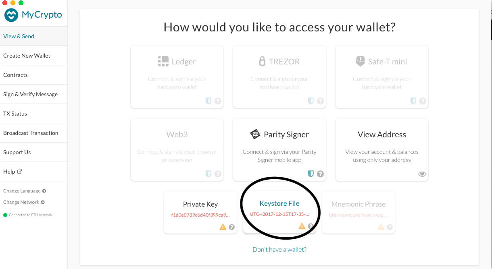
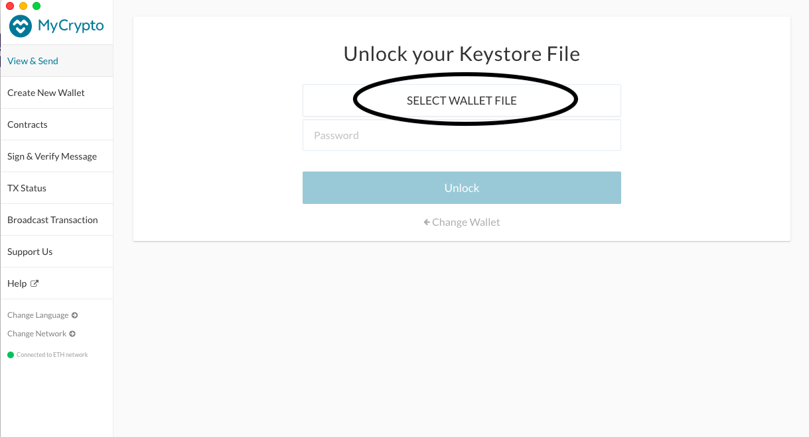
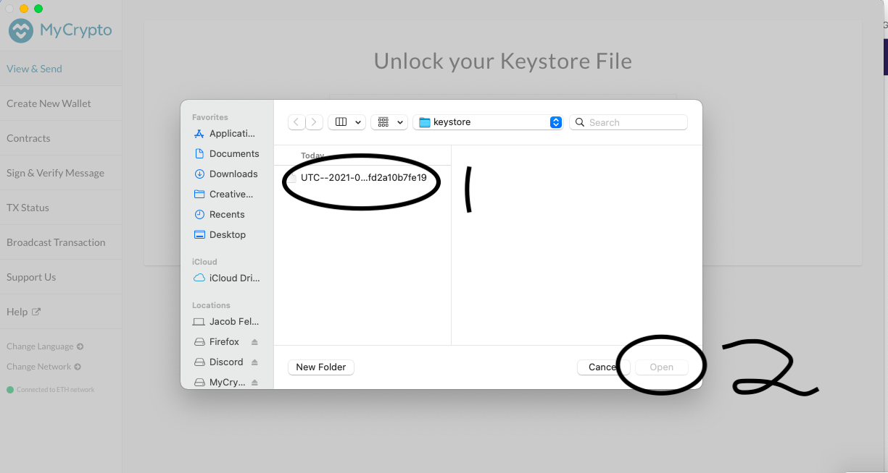
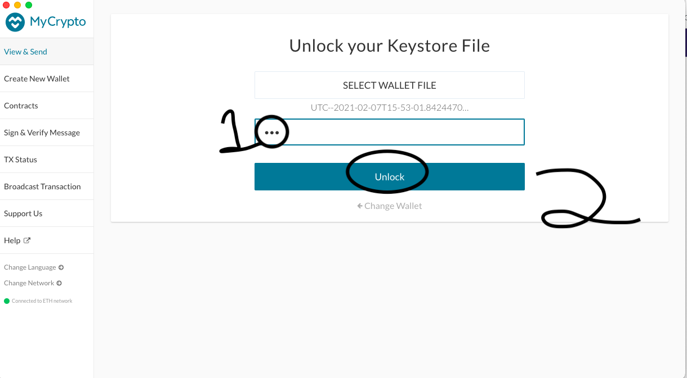
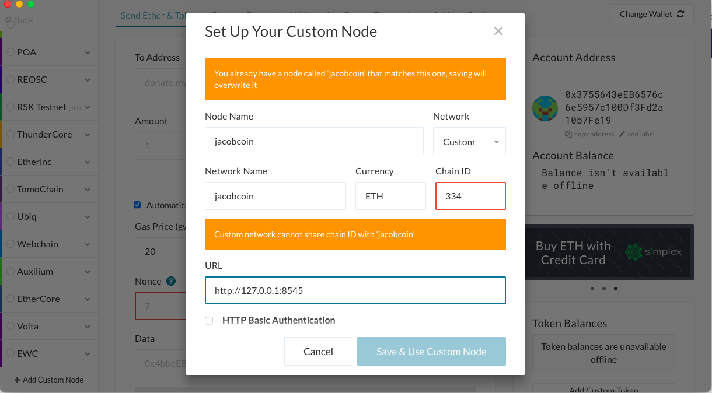
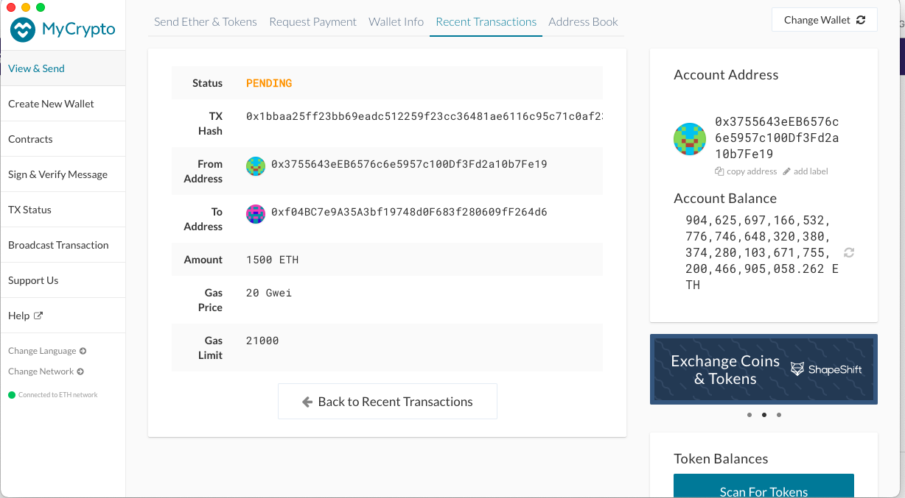

# Blockchain Homework

## Welcome to Jacob Coin! A private blockchain that runs directly from your personal computer! 

### Installation is as follows... 

1. Head on over to https://geth.ethereum.org/downloads/, scroll down the main page to download the correct version for your local machine. **Protip** unzip the files into a new directory! 
    - These files enable you to run your own private blockchain!
2. Next, head on over to https://download.mycrypto.com/ and download the correct version of the MyCrypto app for your local machine's OS.
    - This application enables you to send transactions and view your transaction history on a well built graphical user interface!
3. Once all installations are complete, open up your machine's gitbash or terminal and cd to the directory that contains your recentenly downloaded geth files.
4. Once in the right directory, enter the following two commands one after the other ./geth --datadir node1 account new & ./geth --datadir node1 account new.
    - **For Mac Users** If you are having difficulty openning the geth application, there is a manual override in your Finder application. Head over to your geth directory and click on the geth file. A warning message may pop up, but click through to allow the applicatino to run. Repeat the above steps.
    - A blockchain is comprised of a network of nodes (think of these as computers) that talk to one another. Thanks to geth's application, creating nodes for a test network is made easy! Blockchain can be thought of as a distributed ledger, imagine a google excell spreadsheet, that anyone can see. In order for something to be distributed, there needs to be more than one person, or node, accessing the data. Thus we create two nodes to make it simple. 
5. After running those two commands, remember to safely story the public keys as well as the password generated in a separate text file. These are incredibly important for your blockchain to run!
6.  Time to run puppeth! Input ./puppeth into your terminal in order to start the application.
    - Create your own network name
    - Select option 2 to create a new genesis block
    - Choose the Clique (Proof of Authority) consensus algorithm.
    - Paste both account addresses from the first step one at a time into the list of accounts to seal.
    - Paste them again in the list of accounts to pre-fund. There are no block rewards in PoA, so you'll need to pre-fund.
    - Choose no for pre-funding the pre-compiled accounts (0x1 .. 0xff) with wei. This keeps the genesis cleaner.
    - Specify your chain ID - stick with something simple! Use 334.
    - Export genesis configurations. This will fail to create two of the files, but you only need networkname.json.
    - You can now use the control-C command to exit out of puppeth!
7. Voila! You've just created your first private blockchain! Now time to initialize the nodes. Enter the following two commands into your CLI: ./geth --datadir node1 init {networkname}.json ./geth --datadir node2 init {networkname}.json 
    - Make sure to insert your own network name into the json file's network name.
    - This prepares the nodes for activation and the mining process!
8. Time to open up two new windows in your terminal! In the first window run the following command, adding the first public key to "SEALER_ONE_ADDRESS" ./geth --datadir node1 --unlock "SEALER_ONE_ADDRESS" --mine --minerthreads 1
    - This command starts your first node.
9. As soon as you see the script running, quickly, copy the enode address. It should look something like this: node://78e87ee1de83409ce5bbf6339d6ddc08536538bee244f17ab807c98f6288a3a7634ffa544ed7b91b694c0a5e0e5df6d4189e9ae2d160d02a4224e306ecbf0138@127.0.0.1:30303
10. In the second window, execute the following command while changing the "SEALER_TWO_ADDRESS" to node2's public key and "SEALER_ONE_ENODE_ADDRESS" to the enode link copied from node1:
    - For windows users: ./geth --datadir node2 --unlock "SEALER_TWO_ADDRESS" --port 30304 --rpc --bootnodes "SEALER_ONE_ENODE_ADDRESS" --ipcdisable --allow-insecure-unlock   
    - For mac users: ./geth --datadir node2 --unlock "SEALER_TWO_ADDRESS" --port 30304 --rpc --bootnodes "SEALER_ONE_ENODE_ADDRESS" --allow-insecure-unlock
11. **TA-DA!!** Your blockchain is up and running!!
12. Time to head on over to your MyCrypto App. 
13. After opening the app, sign into one of your node wallets via the keystore file. Enter your password and enter the app. 

14. From there, you will need to access your custom blockchain by creating a custom network.  

15. Well done! You are all ready to send transactions to the other node in the network! You can check your transactions in the TX history folder!
    - The transaction might take a while for it to go through but the page will look like this! 
    